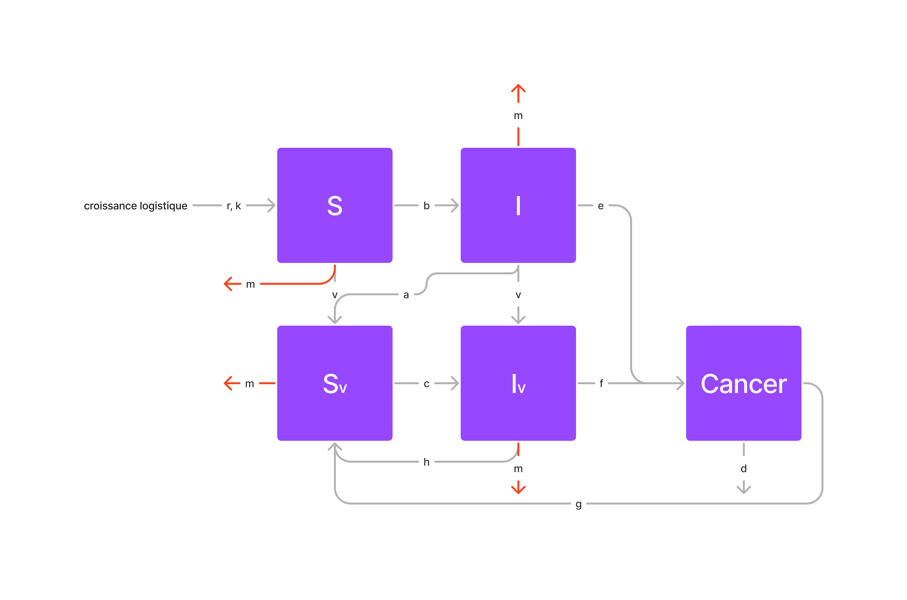

```{r}
library(deSolve)
library(tidyverse)
library(gganimate)
```

# Model



$$
\begin{align*}
\frac{dS}{dt} &= r(S+S_v+I+I_v+C) - \frac{rS^2}{k}) - vS - bS(I+I_v)\\
\frac{dI}{dt} &= bS(I+I_v) - (a+e+v)I - \frac{rI^2}{k}\\
\frac{dS_v}{dt} &= vS +aI+ hI_v + gC - cS_v (I+I_v) - \frac{rS_v^2}{k}\\
\frac{dI_v}{dt} &= vI + cS_v (I+I_v) - (h+f) I_v -  \frac{rI_v^2}{k}\\
\frac{dC}{dt} &=  eI + fI_v - (d +g) C - \frac{rC^2}{k}\\
\end{align*}
$$

Les variables :

- $S$ : Nombre d'individus sains n'ayant pas été vaccinés dans la population
- $S_v$ : Nombre d'individus sains vaccinés
- $I$ : Nombre de personnes non-vaccinées infectées par le papillomavirus humain
- $I_v$ : Nombre de personnes vaccinées infectées par le papillomavirus humain
- $C$ : Nombre de personnes pour lesquelles l'infection évolue en cancer du col de l'utérus.

Les paramètres :

- $r$, $k$ : r est le taux de reproduction et k la capacité d'accueil (ici de la population humaine) dans le cadre d'une croissance logistique suivie par la population (mortalité et naissances indépendantes du cancer pour toutes les "cases" de notre modèle sauf $C$ qui a un taux de mortalité plus élevé). En effet, on considère que toutes nos cases ont un taux mortalité identique indépendant de l'infection, et que, le cancer, le vaccin ou l'infection n'ayant pas de conséquence sur la reproduction des individus, le taux de reproduction est également le même pour toutes les cases.
- $m$ : taux de mortalité naturelle (sans influence du cancer)
- $d$ : taux de mortalité due au cancer du col de l'utérus
- $v$ : taux de vaccination
- $b$, $c$ : taux d'infection par le papillomavirus humain des personnes saines (b) et des personnes saines vaccinées (c)
- $e$, $f$ : taux d'évolution de l'infection en cancer chez les infectés (e) et les infectés vaccinés (f)
- $a$, $h$ : taux de guérison de l'infection sans cancer pour les infectés (a) et les infectés vaccinés (h). ces individus sont tous considérés comme individus sains vaccinés après leur guérison.
- $g$ : taux de guérison du cancer du col de l'utérus. Ces individus sont aussi considérés comme vaccinés après leur guérison puisqu'on ne parle que des cancers du col de l'utérus du au papillome humain dans notre modèle (un cancer résulte alors systématiquement d'une exposition à la souche.

```{r}
time_vector <- seq(0, 100, 0.25)
init <- c(S = 9999, I = 1, Sv = 0, Iv = 0, C = 0)
params <- c(
  # croissance logistique :
  r = 1.1,
  k = 10000,

  # taux de mortalité: ok
  m = 0.0097, # mort naturel
  d = 0.047, # mort par cancer TBD

  # taux de contamination:
  b = 5e-4, # non vacciné
  c = 1e-4, # vacciné

  # taux de vaccination:
  v = 0.04,

  # taux de guérison:
  a = 0.07, # non vacciné
  h = 0.09, # vacciné

  # taux de cancer: ok
  e = 0.05, # non vacciné
  f = 0.02, # vacciné

  # taux guérison cancer
  g = 0.5
)

logisticFunction <- function(N, r, k) {
  N * r * (1 - N / k)
}

modeleSIC <- function(t, y, params) {
  with(as.list(c(y, params)), {
    dS <- r * (S + I + Iv + Sv + C) - (r * S ^ 2)/k -
      v * S -
      b * S * (I + Iv)
    dI <- b * S * (I + Iv) - (a + e + v) * I - r/k * I ^ 2
    dSv <- v * S + a * I + h * Iv + g * C -
      c * Sv * (I + Iv) - m * Sv ^ 2
    dIv <- v * I + c * Sv * (I + Iv) - (h + f) * Iv - r/k* Iv ^ 2
    dC <- e * I + f * Iv - (g+d) * C - r/k * C ^ 2
    return(list(c(dS, dI, dSv, dIv, dC)))
  })
}
```

```{r}
results <- as.data.frame(lsoda(init, time_vector, modeleSIC, params))

results %>%
  pivot_longer(!time, names_to = "pop", values_to = "N") %>%
  ggplot() +
  geom_line(aes(x = time, y = N, color = pop)) +
  labs(y = "Effectif", x = "Temps",
       title = "Exemple de dynamique de modèle SIR",
       color = "Population")

```

```{r}
results %>%
  transmute(time, S = S + Sv, I = I + Iv, C) %>%
  pivot_longer(!time, names_to = "pop", values_to = "N") %>%
  ggplot() +
  geom_line(aes(x = time, y = N, color = pop)) +
  labs(y = "Effectif", x = "Temps",
       title = "Exemple de dynamique de modèle SIR",
       color = "Population")
```

```{r}
results %>%
  group_by(time) %>%
  summarise(tot = sum(S, Sv, I, Iv, C), S = sum(S, Sv) / tot * 100, I = sum(I, Iv) / tot * 100, C = C / tot * 100)
```


## Annalyse de sensibilité

```{r}
sensibility <- function(key, values) {
  results <- NULL
  paramsSensib <- params
  for (value in values) {
    paramsSensib[key] <- value
    result <- as.data.frame(lsoda(init, time_vector, modeleSIC, paramsSensib)) %>%
      pivot_longer(!time, names_to = "pop", values_to = "N") %>%
      mutate(sensib = as.numeric(value))

    # update results vector
    if (exists("results")) {
      results <- rbind(results, result)
    } else {
      results <- result
    }
  }
  return(results)
}
```

```{r}
animate_sensibility <- function(data, ...) {
  data %>%
    ggplot() +
    geom_line(aes(x = time, y = N, color = pop)) +
    labs(y = "Effectif", x = "Temps",
         color = "Population", ...) +
    transition_states(sensib) +
    ease_aes('linear')
}
```

```{r}
sensibility("c", seq(0, 0.0001, 0.00001)) %>%
  animate_sensibility(title = "C = {closest_state}")


```

### paramètre $b$

```{r}
sensibility("b", 1:10 / 100000) %>%
  group_by(sensib) %>%
  ggplot() +
  geom_line(aes(x = time, y = N, color = as.factor(sensib))) +
  facet_grid(~pop) +
  labs(y = "Effectif", x = "Temps",
       title = "Analyse de sensibilité de dynamique de modèle SIR au paramètre beta",
       linetype = "Population",
       color = "Valeur de beta")

```

### paramètre $c$

```{r}
sensibility("c", seq(0.0001, 0, -0.00001)) %>%
  ggplot() +
  geom_line(aes(x = time, y = N, color = as.factor(sensib))) +
  facet_grid(~pop) +
  labs(y = "Effectif", x = "Temps",
       title = "Analyse de sensibilité de dynamique de modèle SIR au paramètre c",
       linetype = "Population",
       color = "Valeur de c")

```


