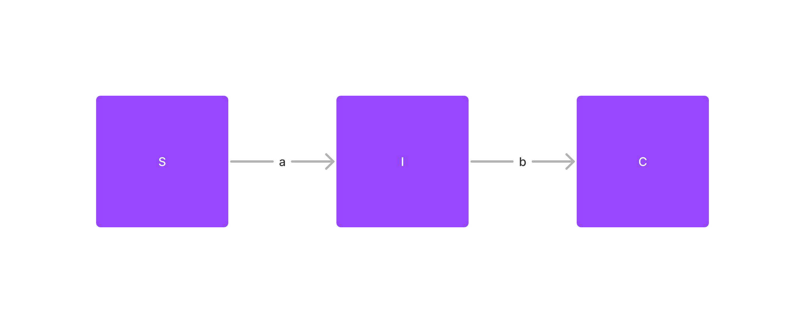
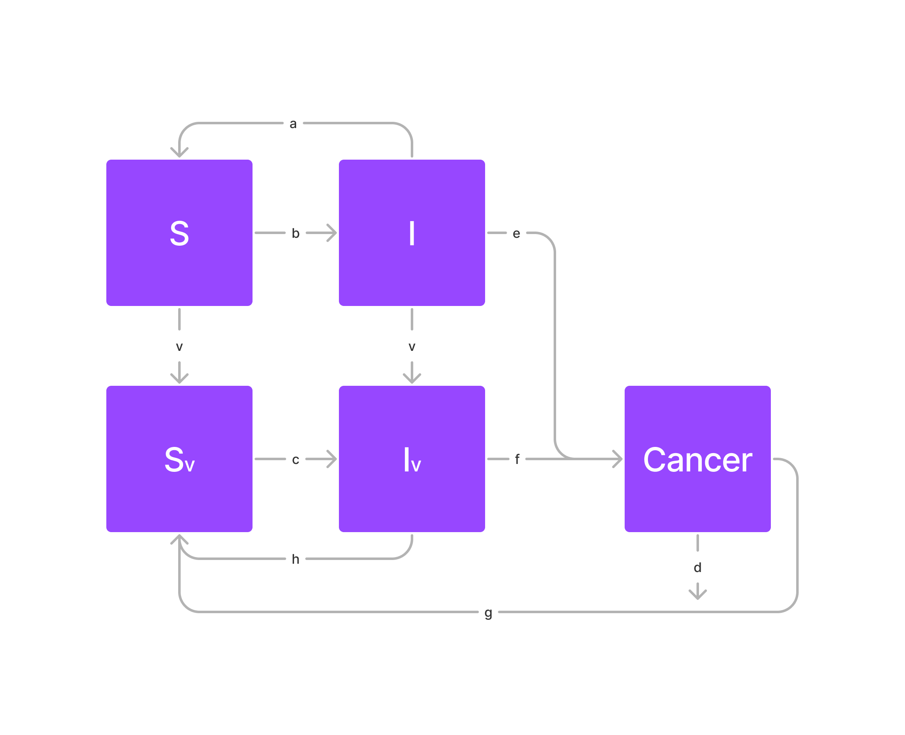

```{r setup, include=FALSE}
knitr::opts_chunk$set(fig.width = 12, fig.height = 8)
```

```{r}
library(deSolve)
library(tidyverse)
library(gganimate)
```

# Introduction

Le papillomavirus humain ou HPV (Human Papillomavirus) est un virus qui touche 80% de la population au début de la vie sexuelle. Cette infection peut affecter différentes muqueuses chez les femmes comme chez les hommes et peut évoluer sous différentes formes de cancer au niveau des régions génitales, anales et oropharyngées. Dans notre modèle, nous ne parlerons que des cas de cancer du col de l'utérus chez la femme, car cela représente la majorité des cas. Si l'infection par ce virus sexuellement transmissible ne provoque en général aucuns problèmes, dans 10% des cas, elle provoque des lésions précancéreuses qui peuvent évoluer en un cancer du col de l'utérus 10 à 15 ans après l'infection. Des vaccins tels que le [Gardasil](https://youtu.be/pL5_p-tnA-g) sont maintenant disponibles afin de protéger contre le HPV qui est responsable de 70% des cancers du col de l'utérus. Ils peuvent être faits aux adolescents et jeunes adultes avec des doses différentes en fonction de leur âge. Nous avons donc réalisé un modèle prenant en compte l'influence sur l'infection.

> Comment modéliser l'infection d'une population humaine par le papillomavirus, l'évolution vers des cas de cancers et l'effet du vaccin sur le modèle ?

# Modèle

Dans un premier temps, nous avons modélisé un modèle basé sur un modèle SIR simple, prenant en compte les individus sains ($S$), les individus infectés ($I$) et les individus pour lesquels l'infection a évolué en cancer du col de l'utérus ($C$). Ce modèle fait intervenir 3 paramètres :


Le modèle n'est pas complet puisque, comme vu précédemment, l'infection par le virus ne résulte pas systématiquement en un cancer ; la plupart des gens guérissent simplement de l'infection. Cela a pu être modélisée par une flèche retour de la case $I$ à la case $S$. De plus, le cancer peut être mortel dans certain cas (taux de décès du cancer $d$) et peut amener à une rémission changeant l'état des individus atteints du cancer en individus sain (taux de guérison du cancer f) :


Ce modèle, bien que plus complet que le dernier, ne prend pas en compte la vaccination qui réduit les taux d'infection et d'évolution de l'infection en cancer. On crée donc 2 nouvelles variables $S_v$ et $I_v$ représentant les individus sains et infectés ayant reçu le vaccin avec un taux de vaccination $v$ (ce taux est le même pour les deux cases, car on considère que les gens infectés ne sont pas différents des personnes saines dans la prise du vaccin puisque les symptômes de l'infection (s'il y en a) n'arrive que très longtemps après l'infection et donc à un moment de la vie ou on ne vaccine plus). Enfin, nous avons également considéré que les personnes atteintes et vaccinées pouvaient soit guérir (flèche de retour) soit développer un cancer du col de l'utérus (flèche allant vers $C$) :


Enfin, nous avons remarqué que la population diminuait continuellement au cours du temps, car nous ne prenions pas en compte les naissances. Nous avons alors considéré que, quelque soit l'état de l'individu (infectés, sain, vacciné, atteint d'un cancer...), ce dernier pouvait mourir d'une autre cause et se reproduire normalement. Nous avons donc rajouté une croissance logistique appliquée à toutes nos variables afin de modéliser les naissances et la capacité maximale associée à la population humaine (paramètres $r$ et $k$) ainsi qu'un taux de mortalité $\frac{r}{k}$ identique pour tous les types d'individus. De plus nous avons considéré qu'une personne ayant déjà contracté l'infection pouvait être considérée comme une personne vaccinée, à l'aide de la mémoire immunitaire (flèche allant de $I$ à $S_v$ et de $C$ à $S_v$) :


Ce modèle nous donne donc les variables et paramètres suivants :

Les variables :

- $S$ : Nombre d'individus sains n'ayant pas été vaccinés (ou infectés) dans la population
- $S_v$ : Nombre d'individus sains vaccinés. On considère en réalité toutes les personnes qui ont été exposées au moins une fois à la souche (vaccinée ou infecté/atteinte d'un cancer)
- $I$ : Nombre de personnes non-vaccinées (ou non déjà infectés auparavant) infectées par le papillomavirus humain
- $I_v$ : Nombre de personnes vaccinées (ou infectées) infectées par le papillomavirus humain
- $C$ : Nombre de personnes pour lesquelles l'infection évolue en cancer du col de l'utérus.

Les paramètres :

- $r$, $k$ : r est le taux de reproduction et k la capacité d'accueil (ici de la population humaine) dans le cadre d'une croissance logistique suivie par la population (mortalité et naissances indépendantes du cancer pour toutes les "cases" de notre modèle sauf $C$ qui a un taux de mortalité plus élevé). En effet, on considère que toutes nos cases ont un taux mortalité identique indépendant de l'infection, et que, le cancer, le vaccin ou l'infection n'ayant pas de conséquence sur la reproduction des individus, le taux de reproduction est également le même pour toutes les cases.
- $d$ : taux de mortalité due au cancer du col de l'utérus
- $v$ : taux de vaccination
- $b$, $c$ : taux d'infection par le papillomavirus humain des personnes saines (b) et des personnes saines vaccinées (c)
- $e$, $f$ : taux d'évolution de l'infection en cancer chez les infectés (e) et les infectés vaccinés (f)
- $a$, $h$ : taux de guérison de l'infection sans cancer pour les infectés (a) et les infectés vaccinés (h). ces individus sont tous considérés comme individus sains vaccinés après leur guérison.
- $g$ : taux de guérison du cancer du col de l'utérus. Ces individus sont aussi considérés comme vaccinés après leur guérison puisqu'on ne parle que des cancers du col de l'utérus du au papillome humain dans notre modèle (un cancer résulte alors systématiquement d'une exposition à la souche.


Nous pouvons traduire mathématiquement ce modèle final par les équations suivantes :

$$
\begin{align*}
\frac{dS}{dt} &= r(S+S_v+I+I_v+C) - \frac{rS^2}{k}) - vS - bS(I+I_v)\\
\frac{dI}{dt} &= bS(I+I_v) - (a+e+v)I - \frac{rI^2}{k}\\
\frac{dS_v}{dt} &= vS +aI+ hI_v + gC - cS_v (I+I_v) - \frac{rS_v^2}{k}\\
\frac{dI_v}{dt} &= vI + cS_v (I+I_v) - (h+f) I_v -  \frac{rI_v^2}{k}\\
\frac{dC}{dt} &=  eI + fI_v - (d +g) C - \frac{rC^2}{k}\\
\end{align*}
$$


# Analyse du modèle

## Implémentation du modèle

Pour analyser ce modèle, il faut au préalable l'implémenter dans R. Pour ce faire, on définit :

- Un vecteur de temps `time_vector` qui va de 0 à 50 avec un pas de 0.25, avec lequel on va pouvoir effectuer nos simulations numériques.
- les valeurs initiales des variables `init` (c'est à dire au temps : $t = 0$) à savoir `S = 9999`, `I = 1 ` et `Sv`, `Iv`, `C` qui sont toutes égales à 0,
- Et les paramètres du modèle `params`. Pour avoir des résultats cohérents, nous avons cherché dans la littérature des valeurs probables des paramètres en sachant que dans la population actuelle, nous avons 80% de la population infectée par le HPV et 4% de la population atteinte par le cancer de l'utérus.

```{r}
time_vector <- seq(0, 50, 0.25)
init <- c(S = 9999, I = 1, Sv = 0, Iv = 0, C = 0)
params <- c(
  # croissance logistique :
  r = 1.1,
  k = 10000,

  # taux de mortalité:
  d = 0.047, # mort par cancer TBD

  # taux de contamination:
  b = 5e-4, # non vacciné
  c = 1e-4, # vacciné

  # taux de vaccination:
  v = 0.04,

  # taux de guérison:
  a = 0.07, # non vacciné
  h = 0.09, # vacciné

  # taux de cancer:
  e = 0.04, # non vacciné
  f = 0.01, # vacciné

  # taux guérison cancer
  g = 0.5
)
```

Ensuite, nous écrivons une fonction que nous pourrons passer à notre solveur d'équations différentielles `lsoda` permettant de résoudre notre système. Cette fonction prend en paramètres le temps `t`, les variables `y` et les paramètres `params` et retourne les dérivées des variables `dydt`.

```{r}
modeleSIC <- function(t, y, params) {
  with(as.list(c(y, params)), {
    dS <- r * (S + I + Iv + Sv + C) -
      (r * S^2) / k -
      v * S -
      b * S * (I + Iv)
    dI <- b * S * (I + Iv) -
      a * I - e * I + v * I -
      (r * I^2) / k
    dSv <- v * S + a * I + h * Iv + g * C -
      c * Sv * (I + Iv) -
      (r * Sv^2) / k
    dIv <- v * I + c * Sv * (I + Iv) -
      (h + f) * Iv -
      (r * Iv^2) / k
    dC <- e * I + f * Iv - (g + d) * C - (r * C^2) / k
    return(list(c(dS, dI, dSv, dIv, dC)))
  })
}
```

## Simulation du modèle

Une fois cette fonction implémentée, nous pouvons utiliser la fonction `lsoda` du package `deSolve` pour réaliser une simulation numérique de ce système d'équations différentielles en utilisant les paramètres et les conditions initiales définis précédemment.


```{r}
results <- as.data.frame(lsoda(init, time_vector, modeleSIC, params))
head(results)
```

Une fois les résultats obtenus, nous pouvons les visualiser à l'aide de la fonction `ggplot` du package `ggplot2`. Nous traçons alors les courbes des effectifs de chaque groupe en fonction du temps.

```{r}
results %>%
  pivot_longer(!time, names_to = "pop", values_to = "N") %>%
  ggplot() +
  geom_line(aes(x = time, y = N, color = pop)) +
  labs(y = "Effectif", x = "Temps",
       title = "Evolution de l'effectif des groupes du modèle en fonction du temps",
       color = "Population")
```

Nous observons alors que le nombre de personnes infectées augmente très brusquement avec un pic avant de rapidement se stabiliser (après 10 générations environs). À l'inverse, le nombre de personnes saines diminue très rapidement avant de se stabiliser. Le nombre de personnes vaccinées suit une courbe logarithmique avant d'atteindre un équilibre et le nombre de personnes atteintes par le cancer suis une sigmoïde jusqu'à se stabiliser. Enfin, le nombre de personnes infectées par le HPV et vaccinées augmente très rapidement avant de se stabiliser à une valeur moindre que le nombre de personnes infectées non vaccinées, mais est légèrement décalé dans le temps par rapport à la courbe de $I_v$.

Ensuite, pour avoir une idée globale de l'avancée de la maladie, nous regroupons ensemble les personnes saines vaccinées et non vaccinées, et de même pour les personnes infectées. Nous obtenons alors le graphique suivant :

```{r}
results %>%
  transmute(time, S = S + Sv, I = I + Iv, C) %>%
  pivot_longer(!time, names_to = "pop", values_to = "N") %>%
  ggplot() +
  geom_line(aes(x = time, y = N, color = pop)) +
  labs(y = "Effectif", x = "Temps",
       title = "Évolution de l'effectif des groupes avec addition des groupes vaccinés et non vaccinés en fonction du temps",
       color = "Population")
```

Nous pouvons observer que le nombre de personnes infectées augmente très brusquement avec un pic avant de rapidement se stabiliser. À l'inverse, le nombre de personnes saines diminue très rapidement avant de se stabiliser à son tour. Le nombre de personnes atteintes par le cancer suis une sigmoïde jusqu'à se stabiliser.

Enfin, dans le but de valider les paramètres choisis, nous avons calculé le pourcentage de chacun des compartiments par rapport au nombre total d'individus, le tout multiplié par 100. Nous obtenons alors le tableau suivant :

```{r}
results %>%
  group_by(time) %>%
  summarise(tot = sum(S, Sv, I, Iv, C), S = sum(S, Sv) / tot * 100, I = sum(I, Iv) / tot * 100, C = C / tot * 100) %>%
  tail()
```

Comme les valeurs correspondent aux résultats que nous observons dans la nature, nous pouvons conclure que nos paramètres semble globalement correct. Nous pouvons alors faire un diagramme en bâtons pour mieux visualiser les résultats obtenus :


```{r}
results %>%
  group_by(time) %>%
  summarise(tot = sum(S, Sv, I, Iv, C), S = sum(S, Sv) / tot * 100, I = sum(I, Iv) / tot * 100, C = C / tot * 100) %>%
  mutate(tot = NULL) %>%
  pivot_longer(!time, names_to = "pop", values_to = "N") %>%
  ggplot() +
  geom_col(aes(x = time, y = N, fill = pop)) +
  labs(y = "Pourcentage", x = "Temps",
       title = "Pourcentage de chaque compartiment en fonction du temps",
       fill = "Population")
```

# Analyse de sensibilité

Dans un premier temps, nous implémentons une fonction qui permet de réaliser une analyse de sensibilité sur un modèle donné. Cette fonction prend en entrée le modèle, la clée correspond au paramètre que l'on veut analyser, et le vecteur contenant les différentes valeurs que va prendre le paramètre.

```{r}
sensibility <- function(key, values) {
  results <- NULL
  paramsSensib <- params
  for (value in values) {
    paramsSensib[key] <- value
    result <- as.data.frame(lsoda(init, time_vector, modeleSIC, paramsSensib)) %>%
      pivot_longer(!time, names_to = "pop", values_to = "N") %>%
      mutate(sensib = as.numeric(value))

    # update results vector
    if (exists("results")) {
      results <- rbind(results, result)
    } else {
      results <- result
    }
  }
  return(results)
}
```

Ensuite, nous définissons une fonction qui permet de représenter sous forme d'une animation l'évolution du modèle en fonction de l'analyse de sensibilité obtenue à l'aide de la fonction précédente.

```{r}
animate_sensibility <- function(data, ...) {
  data %>%
    ggplot() +
    geom_line(aes(x = time, y = N, color = pop)) +
    labs(y = "Effectif", x = "Temps",
         color = "Population", ...) +
    transition_states(sensib) +
    ease_aes('linear')
}
```

Enfin, nous définissons une fonction permettant de représenter sous forme d'un graphique l'évolution du modèle en fonction de l'analyse de sensibilité obtenue à l'aide de la fonction précédente. Nous utilisons ici la fonction `facet_grid` pour pouvoir séparer les différents compartiments sur plusieurs graphiques séparer afin de facilité la lisibilité d graphique.

```{r}
plot_sensibility <- function(data, key, ...) {
  data %>%
    ggplot() +
    geom_line(aes(x = time, y = N, color = as.factor(sensib))) +
    facet_grid(~pop) +
    labs(y = "Effectif", x = "Temps",
         linetype = "Population",
         color = glue::glue("Valeurs de {key}"), ...)
}
```


## Analyse de sensibilité sur le taux d'infection par le papillomavirus humain des personnes saines $b$

Nous réalisons une analyse de sensibilité sur le taux d'infection par le papillomavirus humain des personnes saines $b$. Nous avons choisi de prendre des valeurs de $b$ allant de $1\times 10 ^{-5}$ à $7\times 10^{-4}$ avec un pas de $1\times 10^{-5}$.

Dans un premier temps, nous affichons toutes les sensibilités sur un graphique :

```{r}
sensibility("b", 1:70 / 100000) %>%
  plot_sensibility(key = "b", title = "Analyse de sensibilité sur le taux d'infection par le papillomavirus humain des personnes saines (b)")
```

Ensuite pour faciliter la lecture du graphique, nous affichons les sensibilités sur une animation :

```{r}
sensibility("b", 1:70 / 100000) %>%
  animate_sensibility(title = "b = {closest_state}")
```

Nous remarquons alors que le paramètre $b$ a un impact sur le nombre de personnes infectées par le papillomavirus humain. Quand $b$ est petit le nombre de personnes infectées par le papillomavirus humain est inférieur au nombre de personnes saines, mais quand $b$ est grand le nombre de personnes infectées par le papillomavirus humain est supérieur au nombre de personnes saines. Nous pouvons alors en conclure que le paramètre $b$ a un impact sur le nombre de personnes infectées par le papillomavirus humain.

## Analyse de sensibilité sur le taux d'infection par le papillomavirus humain des personnes saines vacciné $c$

Ici, nous faisons de même que précédemment, mais pour le paramètre $c$.

```{r}
sensibility("c", 1:20 / 100000) %>%
  plot_sensibility(key = "c", title = "Analyse de sensibilité de dynamique du modèle au paramètre c")
```

```{r}
sensibility("c", 1:20 / 100000) %>%
  animate_sensibility(title = "C = {closest_state}")
```

Nous observons alors que, comme pour $b$, le paramètre $c$ a un impact sur le nombre de personnes infectées par le papillomavirus humain. Quand $c$ est petit le nombre de personnes infectées par le papillomavirus humain est inférieur au nombre de personnes saines vaccinées, mais quand $c$ est grand le nombre de personnes infectées par le papillomavirus humain est supérieur au nombre de personnes saines vaccinées.

## Analyse de sensibilité sur le taux de vaccination $v$

Ici, nous procédons de la même façon, mais pour le paramètre $v$. Nous avons choisi de prendre des valeurs de $v$ allant de $0$ à $1$ avec un pas de $0.01$.

```{r}
sensibility("v", seq(0, 1, 0.01)) %>%
  plot_sensibility(key = "v", title = "Analyse de sensibilité de dynamique du modèle au paramètre v")
```

```{r}
sensibility("v", seq(0, 1, 0.01)) %>%
  animate_sensibility(title = "V = {closest_state}")
```

Nous pouvons remarquer que le paramètre $v$ (le taux de vaccination) a un impact sur le nombre de personnes saines vaccinées, ce dernier augmentant avec le taux de vaccination. Nous pouvons également remarquer que ce paramètre a un effet sur le nombre de personnes infectées par le papillomavirus humain. Nous observons en effet qu'il diminue avec le taux de vaccination. Cependant, nous remarquons que le nombre de personnes infectées vaccinées augmente avec le taux de vaccination. Nous pouvons alors conclure que le paramètre $v$ a un impact sur le nombre de personnes saines vaccinées et sur le nombre de personnes infectées par le papillomavirus humain.


## Analyse de sensibilité sur le taux de cancer du col de l'utérus par le papillomavirus humain pour des personnes vaccinées $e$

Nous effectuons la même analyse pour le paramètre $e$. Ici, nous avons choisi de prendre des valeurs de $e$ allant de $0$ à $0.2$ avec un pas de $0.01$.

```{r}
sensibility("e", seq(0, 0.2, 0.01)) %>%
  plot_sensibility(key = "e", title = "Analyse de sensibilité de dynamique du modèle au paramètre e")
```

```{r}
sensibility("e", seq(0, 0.2, 0.01)) %>%
  animate_sensibility(title = "e = {closest_state}")
```

Cette analyse nous montre que le paramètre $e$ à un impact direct sur le nombre de personnes atteintes du cancer, puisque lorsque $e$ augmente, le nombre de personnes atteintes du cancer augmente également. De plus, comme le nombre de personnes atteintes du cancer augmente, les autres catégories diminuent, c'est-à-dire que le nombre de personnes saines (vaccinées ou non) diminue et le nombre de personnes infectées par le papillomavirus humain (vacciné ou non) diminue. Ainsi, nous pouvons conclure que le paramètre $e$ a bien un impact sur le nombre de personnes atteintes du cancer du col de l'utérus par le papillomavirus humain.

## Analyse de sensibilité sur le taux de décès par le cancer du col de l'utérus dû au papillomavirus humain pour des personnes vaccinées $f$

On utilise la même méthode d'analyse pour le paramètre $f$.

```{r}
sensibility("f", seq(0, 0.2, 0.01)) %>%
  plot_sensibility(key = "f", title = "Analyse de sensibilité de dynamique de modèle SIR au paramètre f")
```

```{r}
sensibility("f", seq(0, 0.2, 0.01)) %>%
  animate_sensibility(title = "f = {closest_state}")
```

De même que pour $e$, le paramètre $f$ à un impact direct avec le nombre de personnes atteint du cancer, puisque lorsque $f$ augmente le nombre de personnes atteintes du cancer augmente. Cependant, ici, tous les compartiments ne diminuent pas, car que le nombre de personnes infectées vaccinées diminue, alors que le nombre de personnes infectées non vaccinées augmente. Nous pouvons en déduire que le paramètre $f$ a bien un impact sur le nombre de personnes atteintes du cancer du col de l'utérus par le papillomavirus humain.

## Analyse de sensibilité sur le taux de rémission au virus du papillomavirus humain pour des personnes non vaccinée $a$

Pour l'analyse de sensibilité de $a$, nous avons choisi de prendre des valeurs allant de $0$ à $0.3$ avec un pas de $0.01$.

```{r}
sensibility("a", seq(0, 0.3, 0.01)) %>%
  plot_sensibility(key = "a", title = "Analyse de sensibilité de dynamique de modèle SIR au paramètre a")
```

```{r}
sensibility("a", seq(0, 0.3, 0.01)) %>%
  animate_sensibility(title = "a = {closest_state}")
```

Lorsque le paramètre $a$ augmente, nous pouvons voir le nombre de personnes saines vaccinées ainsi que le nombre de personnes infectées vaccinées augmenter. Nous pouvons également remarquer que le nombre de personnes infectées non vaccinées diminue. Nous pouvons ainsi en déduire que le paramètre $a$ a un impact sur le nombre de personnes saines vaccinées et sur le nombre de personnes infectées par le papillomavirus humain.

## Analyse de sensibilité sur le taux de guérison sde l'infection au virus du papillome humain pour des personnes vaccinées $h$

Pour $h$ l'analyse est identique à celle de $a$.
```{r}
sensibility("h", seq(0, 0.3, 0.01)) %>%
  plot_sensibility(key = "h", title = "Analyse de sensibilité de dynamique de modèle SIR au paramètre h")
```

```{r}
sensibility("h", seq(0, 0.3, 0.01)) %>%
  animate_sensibility(title = "h = {closest_state}")
```

Nous observons ici que lorsque $h$ augmente, le nombre de personnes saines non vaccinées augmente, tandis que le nombre de personnes infectées vaccinées reste stable. Le nombre de personnes infectées non vaccinées augmente également. Nous pouvons alors en conclure que le paramètre $h$ favorise un retour à l'état sain pour les personnes infectées vaccinées.

## Analyse de sensibilité sur le taux de décès par le cancer du col de l'utérus $d$

Ici, nous avons choisi de prendre des valeurs de $d$ allant de $0$ à $0.2$ avec un pas de $0.01$.

```{r}
sensibility("d", seq(0, 0.2, 0.01)) %>%
  plot_sensibility(key = "d", title = "Analyse de sensibilité de dynamique de modèle SIR au paramètre d")
```

```{r}
sensibility("d", 1:10 / 10) %>%
  animate_sensibility(title = "d = {closest_state}")
```

L'analyse indique que lorsque $d$ augmente, le nombre de personnes atteintes du cancer ainsi que le nombre de personnes infectées (qu'elles soient vaccinées ou non) diminue. Nous pouvons donc considérer que le taux de mortalité a un impact sur le nombre de personnes atteintes du cancer du col de l'utérus, mais aussi sur le nombre de personnes infectées par le papillomavirus humain.

## Analyse de sensibilité sur le taux de rémission des personnes atteintes d'un cancer du col de l'utérus $g$

Nous choisissons ici des valeurs de $g$ allant de $0$ à $1$ avec un pas de $0.1$.

```{r}
sensibility("g", seq(0, 1, 0.1)) %>%
  plot_sensibility(key = "g", title = "Analyse de sensibilité de dynamique de modèle SIR au paramètre g")
```

```{r}
sensibility("g", seq(0, 1, 0.1)) %>%
  animate_sensibility(title = "g = {closest_state}")
```

Pour ce paramètre, nous pouvons voir que lorsqu'il augmente, le nombre de personnes atteintes du cancer diminue et le nombre de personnes infectées vaccinées ainsi que le nombre de personnes saines vaccinées augmentent. Ainsi, nous pouvons conclure que le paramètre $g$ a un impact sur le nombre de personnes atteintes du cancer du col de l'utérus, mais aussi sur le nombre de personnes infectées par le papillomavirus humain.


# Conclusion

Au vu des différentes analyses de sensibilité, nous avons pu savoir quels étaient les paramètres déterminants du modèle. Tout d'abord, le paramètre $b$ modélisant l'infection de personnes saines non vaccinées à un impact fort sur le modèle puisqu'il diminue fortement la population non-infectée. Le paramètre $c$ à des effets similaires bien que moins importants, ce dernier représentant l'infection des personnes saines vaccinées (plus rare que l'infection de non vaccinées). Enfin, le taux de vaccination $v$ est également un paramètre clé ; son augmentation entraine une augmentation du nombre de personnes infectées vaccinées, qui ont moins de chance d'être atteintes par le cancer. Cependant, il provoque une augmentation du nombre de personnes saines infectées puisque, malgré tout, le vaccin n'est pas efficace à 100%. Néanmoins, comme ces deux paramètres augmentent parallèlement et que les autres paramètres restent stables, la population globale augmente. Ainsi, la vaccination permet une diminution indirecte du nombre de personnes atteintes du cancer. Il est donc impératif d'augmenter la couverture vaccinale si on souhaite réduire les taux de cancer dans la population (la couverture française étant seulement de 28% en 2020, puis 41% en 2021, et ce, pratiquement exclusivement sur des femmes).