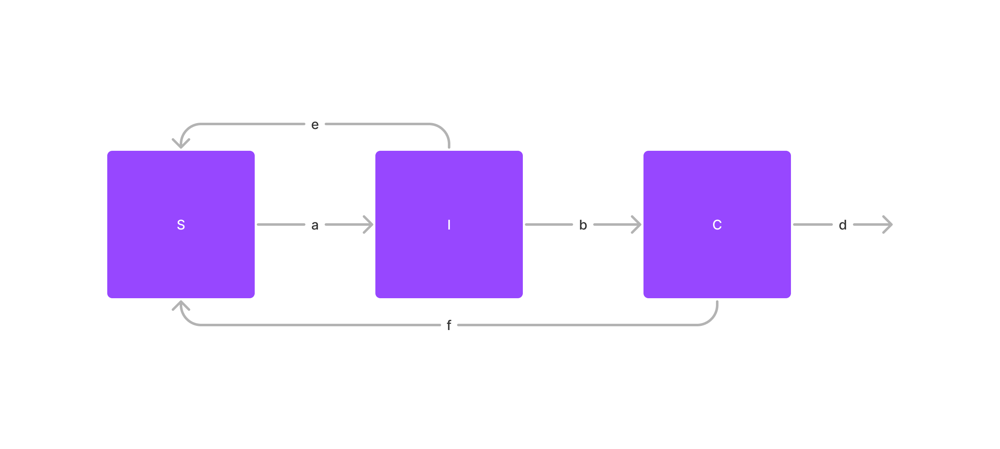
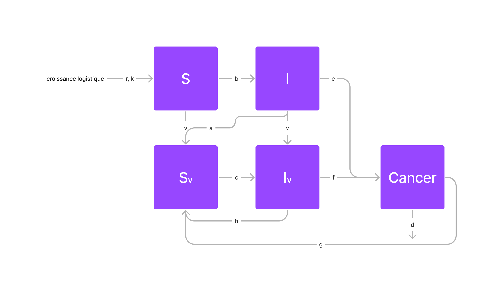

```{r}
library(deSolve)
library(tidyverse)
library(gganimate)
```

# Introduction

Le papillomavirus humain ou HPV (Human Papillomavirus) est un virus qui touche 80% de la population au début de la vie sexuelle. Cette infection peut affecter différentes muqueuses chez les femmes comme chez les hommes et peut évoluer sous différentes formes de cancer au niveau des régions génitales, anales et oropharyngées. Dans notre modèle, nous ne parlerons que des cas de cancer du col de l'utérus chez la femme, car cela représente la majorité des cas. Si l'infection par ce virus sexuellement transmissible ne provoque en général aucuns problèmes, dans 10% des cas, elle provoque des lésions précancéreuses qui peuvent évoluer en un cancer du col de l'utérus 10 à 15 ans après l'infection. Des vaccins tels que le [Gardasil](https://youtu.be/pL5_p-tnA-g) sont maintenant disponibles afin de protéger contre le HPV qui est responsable de 70% des cancers du col de l'utérus. Ils peuvent être faits aux adolescents et jeunes adultes avec des doses différentes en fonction de leur âge. Nous avons donc réalisé un modèle prenant en compte l'influence sur l'infection.

# Model

Dans un premier temps, nous avons modélisé un modèle basé sur un modèle SIR simple, prenant en compte les individus sains ($S$), les individus infectés ($I$) et les individus pour lesquels l'infection a évolué en cancer du col de l'utérus ($C$). Ce modèle fait intervenir 3 paramètres :


Le modèle n'est pas complet puisque, comme vu précédemment, l'infection par le virus ne résulte pas systématiquement en un cancer ; la plupart des gens guérissent simplement de l'infection. Cela a pu être modélisée par une flèche retour de la case $I$ à la case $S$. De plus, le cancer peut être mortel dans certain cas (taux de décès du cancer $d$) et peut amener à une rémission changeant l'état des individus atteints du cancer en individus sain (taux de guérison du cancer f) :


Ce modèle, bien que plus complet que le dernier, ne prend pas en compte la vaccination qui réduit les taux d'infection et d'évolution de l'infection en cancer. On crée donc 2 nouvelles variables $S_v$ et $I_v$ représentant les individus sains et infectés ayant reçu le vaccin avec un taux de vaccination $v$ (ce taux est le même pour les deux cases, car on considère que les gens infectés ne sont pas différents des personnes saines dans la prise du vaccin puisque les symptômes de l'infection (s'il y en a) n'arrive que très longtemps après l'infection et donc à un moment de la vie ou on ne vaccine plus). Enfin, nous avons également considéré que les personnes atteintes et vaccinées pouvaient soit guérir (flèche de retour) soit développer un cancer du col de l'utérus (flèche allant vers $C$) :


Enfin, nous avons remarqué que la population diminuait continuellement au cours du temps, car nous ne prenions pas en compte les naissances. Nous avons alors considéré que, quelque soit l'état de l'individu (infectés, sain, vacciné, atteint d'un cancer...), ce dernier pouvait mourir d'une autre cause et se reproduire normalement. Ainsi, Nous avons donc pu rajoutr une croissance logistique appliquée à toutes nos variables afin de modéliser les naissances et la capacité maximale associée à la population humaine (paramètres $r$ et $k$) ainsi qu'un taux de mortalité $m$ identique pour tous les types d'individus.


Ce modèle nous donne donc les variables et paramètres suivants :

Les variables :

- $S$ : Nombre d'individus sains n'ayant pas été vaccinés (ou infectés) dans la population
- $S_v$ : Nombre d'individus sains vaccinés. On considère en réalité toutes les personnes qui ont été exposées au moins une fois à la souche (vaccinée ou infecté/atteinte d'un cancer)
- $I$ : Nombre de personnes non-vaccinées (ou non déjà infectés auparavant) infectées par le papillomavirus humain
- $I_v$ : Nombre de personnes vaccinées (ou infectées) infectées par le papillomavirus humain
- $C$ : Nombre de personnes pour lesquelles l'infection évolue en cancer du col de l'utérus.

Les paramètres :

- $r$, $k$ : r est le taux de reproduction et k la capacité d'accueil (ici de la population humaine) dans le cadre d'une croissance logistique suivie par la population (mortalité et naissances indépendantes du cancer pour toutes les "cases" de notre modèle sauf $C$ qui a un taux de mortalité plus élevé). En effet, on considère que toutes nos cases ont un taux mortalité identique indépendant de l'infection, et que, le cancer, le vaccin ou l'infection n'ayant pas de conséquence sur la reproduction des individus, le taux de reproduction est également le même pour toutes les cases.
- $m$ : taux de mortalité naturelle (sans influence du cancer)
- $d$ : taux de mortalité due au cancer du col de l'utérus
- $v$ : taux de vaccination
- $b$, $c$ : taux d'infection par le papillomavirus humain des personnes saines (b) et des personnes saines vaccinées (c)
- $e$, $f$ : taux d'évolution de l'infection en cancer chez les infectés (e) et les infectés vaccinés (f)
- $a$, $h$ : taux de guérison de l'infection sans cancer pour les infectés (a) et les infectés vaccinés (h). ces individus sont tous considérés comme individus sains vaccinés après leur guérison.
- $g$ : taux de guérison du cancer du col de l'utérus. Ces individus sont aussi considérés comme vaccinés après leur guérison puisqu'on ne parle que des cancers du col de l'utérus du au papillome humain dans notre modèle (un cancer résulte alors systématiquement d'une exposition à la souche.


Nous pouvons traduire mathématiquement ce modèle final par les équations suivantes :

$$
\begin{align*}
\frac{dS}{dt} &= r(S+S_v+I+I_v+C) - \frac{rS^2}{k}) - vS - bS(I+I_v)\\
\frac{dI}{dt} &= bS(I+I_v) - (a+e+v)I - \frac{rI^2}{k}\\
\frac{dS_v}{dt} &= vS +aI+ hI_v + gC - cS_v (I+I_v) - \frac{rS_v^2}{k}\\
\frac{dI_v}{dt} &= vI + cS_v (I+I_v) - (h+f) I_v -  \frac{rI_v^2}{k}\\
\frac{dC}{dt} &=  eI + fI_v - (d +g) C - \frac{rC^2}{k}\\
\end{align*}
$$


```{r}
time_vector <- seq(0, 50, 0.25)
init <- c(S = 9999, I = 1, Sv = 0, Iv = 0, C = 0)
params <- c(
  # croissance logistique :
  r = 1.1,
  k = 10000,

  # taux de mortalité:
  d = 0.047, # mort par cancer TBD

  # taux de contamination:
  b = 5e-4, # non vacciné
  c = 1e-4, # vacciné

  # taux de vaccination:
  v = 0.04,

  # taux de guérison:
  a = 0.07, # non vacciné
  h = 0.09, # vacciné

  # taux de cancer:
  e = 0.04, # non vacciné
  f = 0.01, # vacciné

  # taux guérison cancer
  g = 0.5
)

modeleSIC <- function(t, y, params) {
  with(as.list(c(y, params)), {
    dS <- r * (S + I + Iv + Sv + C) -
      (r * S^2) / k -
      v * S -
      b * S * (I + Iv)
    dI <- b * S * (I + Iv) -
      a * I - e * I + v * I -
      (r * I^2) / k
    dSv <- v * S + a * I + h * Iv + g * C -
      c * Sv * (I + Iv) -
      (r * Sv^2) / k
    dIv <- v * I + c * Sv * (I + Iv) -
      (h + f) * Iv -
      (r * Iv^2) / k
    dC <- e * I + f * Iv - (g + d) * C - (r * C^2) / k
    return(list(c(dS, dI, dSv, dIv, dC)))
  })
}
```

```{r}
results <- as.data.frame(lsoda(init, time_vector, modeleSIC, params))

results %>%
  pivot_longer(!time, names_to = "pop", values_to = "N") %>%
  ggplot() +
  geom_line(aes(x = time, y = N, color = pop)) +
  labs(y = "Effectif", x = "Temps",
       title = "Exemple de dynamique de modèle SIR",
       color = "Population")

```

```{r}
results %>%
  transmute(time, S = S + Sv, I = I + Iv, C) %>%
  pivot_longer(!time, names_to = "pop", values_to = "N") %>%
  ggplot() +
  geom_line(aes(x = time, y = N, color = pop)) +
  labs(y = "Effectif", x = "Temps",
       title = "Exemple de dynamique de modèle SIR",
       color = "Population")
```

```{r}
results %>%
  group_by(time) %>%
  summarise(tot = sum(S, Sv, I, Iv, C), S = sum(S, Sv) / tot * 100, I = sum(I, Iv) / tot * 100, C = C / tot * 100)
```


## Annalyse de sensibilité

Dans un premier temps, nous implémentons une fonction qui permet de réaliser une analyse de sensibilité sur un modèle donné. Cette fonction prend en entrée le modèle, la clée correspond au paramètre que l'on veut analyser, et le vecteur contenant les différentes valeurs que va prendre le paramètre.

```{r}
sensibility <- function(key, values) {
  results <- NULL
  paramsSensib <- params
  for (value in values) {
    paramsSensib[key] <- value
    result <- as.data.frame(lsoda(init, time_vector, modeleSIC, paramsSensib)) %>%
      pivot_longer(!time, names_to = "pop", values_to = "N") %>%
      mutate(sensib = as.numeric(value))

    # update results vector
    if (exists("results")) {
      results <- rbind(results, result)
    } else {
      results <- result
    }
  }
  return(results)
}
```

Ensuite ont définis une fonction qui permet de représenter sous forme d'une animation l'évolution du modèle en fonction de l'annalyse de sensibilité obtenue a l'aide de la fonction précécdente.

```{r}
animate_sensibility <- function(data, ...) {
  data %>%
    ggplot() +
    geom_line(aes(x = time, y = N, color = pop)) +
    labs(y = "Effectif", x = "Temps",
         color = "Population", ...) +
    transition_states(sensib) +
    ease_aes('linear')
}
```

Enfin, on définit une fonction permetant de

```{r}
plot_sensibility <- function(data, ...) {
  data %>%
    ggplot() +
    geom_line(aes(x = time, y = N, color = as.factor(sensib))) +
    facet_grid(~pop) +
    labs(y = "Effectif", x = "Temps",
         linetype = "Population",
         color = "Valeur de beta", ...)
}
```


### paramètre $b$

```{r}
sensibility("b", 1:70 / 100000) %>%
  plot_sensibility(title = "B = {closest_state}")
```

```{r}
sensibility("b", 1:70 / 100000) %>%
  animate_sensibility(title = "b = {closest_state}")
```

### paramètre $c$

```{r}
sensibility("c", 1:20 / 100000) %>%
  plot_sensibility(title = "Analyse de sensibilité de dynamique de modèle SIR au paramètre c")
```

```{r}
sensibility("c", 1:20 / 100000) %>%
  animate_sensibility(title = "C = {closest_state}")
```


### paramètre $v$

```{r}
sensibility("v", seq(0, 1, 0.01)) %>%
  plot_sensibility(title = "Analyse de sensibilité de dynamique de modèle SIR au paramètre v")
```

```{r}
sensibility("v", seq(0, 1, 0.01)) %>%
  animate_sensibility(title = "V = {closest_state}")
```

# Pour $e$
```{r}
sensibility("e", seq(0, 0.2, 0.01)) %>%
  plot_sensibility(title = "Analyse de sensibilité de dynamique de modèle SIR au paramètre e")
```

```{r}
sensibility("e", seq(0, 0.2, 0.01)) %>%
  animate_sensibility(title = "e = {closest_state}")
```

# Pour $f$
```{r}
sensibility("f", seq(0, 0.2, 0.01)) %>%
  plot_sensibility(title = "Analyse de sensibilité de dynamique de modèle SIR au paramètre f")
```

```{r}
sensibility("f", seq(0, 0.2, 0.01)) %>%
  animate_sensibility(title = "f = {closest_state}")
```

# Pour $a$
```{r}
sensibility("a", seq(0, 0.3, 0.01)) %>%
  plot_sensibility(title = "Analyse de sensibilité de dynamique de modèle SIR au paramètre a")
```

```{r}
sensibility("a", seq(0, 0.3, 0.01)) %>%
  animate_sensibility(title = "a = {closest_state}")
```

# Pour $h$
```{r}
sensibility("h", seq(0, 0.3, 0.01)) %>%
  plot_sensibility(title = "Analyse de sensibilité de dynamique de modèle SIR au paramètre h")
```

```{r}
sensibility("h", seq(0, 0.3, 0.01)) %>%
  animate_sensibility(title = "h = {closest_state}")
```

# Pour $d$
```{r}
sensibility("d", seq(0, 0.2, 0.01)) %>%
  plot_sensibility(title = "Analyse de sensibilité de dynamique de modèle SIR au paramètre d")
```

```{r}
sensibility("d", 1:10 / 10) %>%
  animate_sensibility(title = "d = {closest_state}")
```


# Pour $g$
```{r}
sensibility("g", seq(0, 1, 0.1)) %>%
  plot_sensibility(title = "Analyse de sensibilité de dynamique de modèle SIR au paramètre g")
```

```{r}
sensibility("g", seq(0, 1, 0.1)) %>%
  animate_sensibility(title = "g = {closest_state}")
```